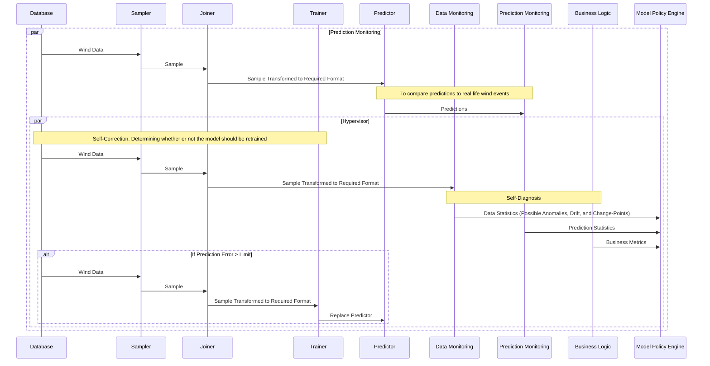
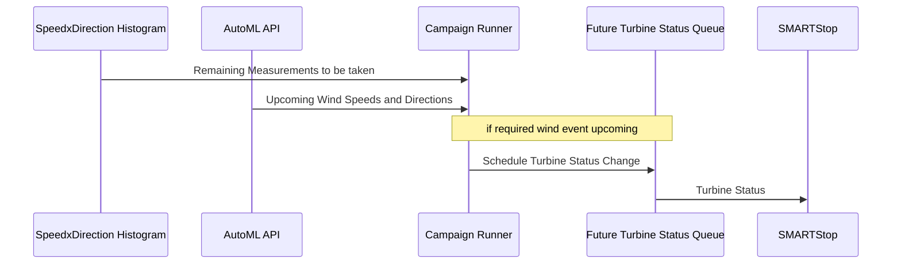
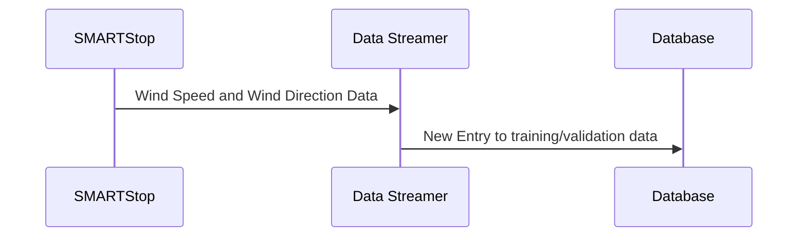

# Proactive and Reactive Decision Making Over Wind Turbine Time Series Data

## How to Run
in the root directory, run:
```
docker-compose build
docker-compose up
```

API is hosted on `localhost:5000`
Database is hosted on `localhost:8086`


## System Overview

### AutoML API


### Turbine Curtailment


### Maintaining Training Set


## Resouces
Data: https://drive.google.com/drive/folders/1OxU2EAok-bl-nMdh3CevdV7jY4nMOJ7Q?usp=sharing

Task tracker: https://github.com/hannahmehravari/dissertation/projects/1
