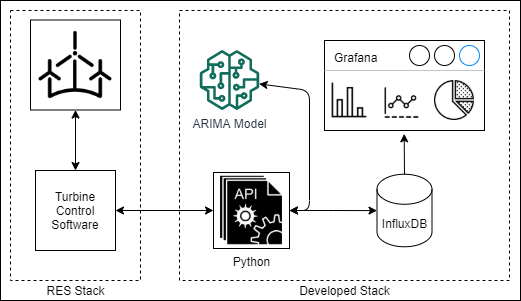

# Proactive and Reactive Decision Making Over Wind Turbine Time Series Data

Supporting code for Hannah Mehravari's final year masters project. The accompanying dissertation report can be read [here](https://github.com/hannahmehravari/dissertation/blob/main/report.pdf).


## How to Run System
in the root directory, run:
```
docker-compose build
docker-compose up
```
Refer to the `.env` file to configure the system setting and ports.

## How to Simulate Turbine Control Software
While the above commands are running, in the root directory, run:
```
conda env create --name envname --file=notebooks/environments.yml
conda activate dissertation
python hit_api.py
```

## How to Run the Notebooks
In the root directory, run:
```
conda env create --name envname --file=notebooks/environments.yml
conda activate dissertation
jupyter notebook
```




