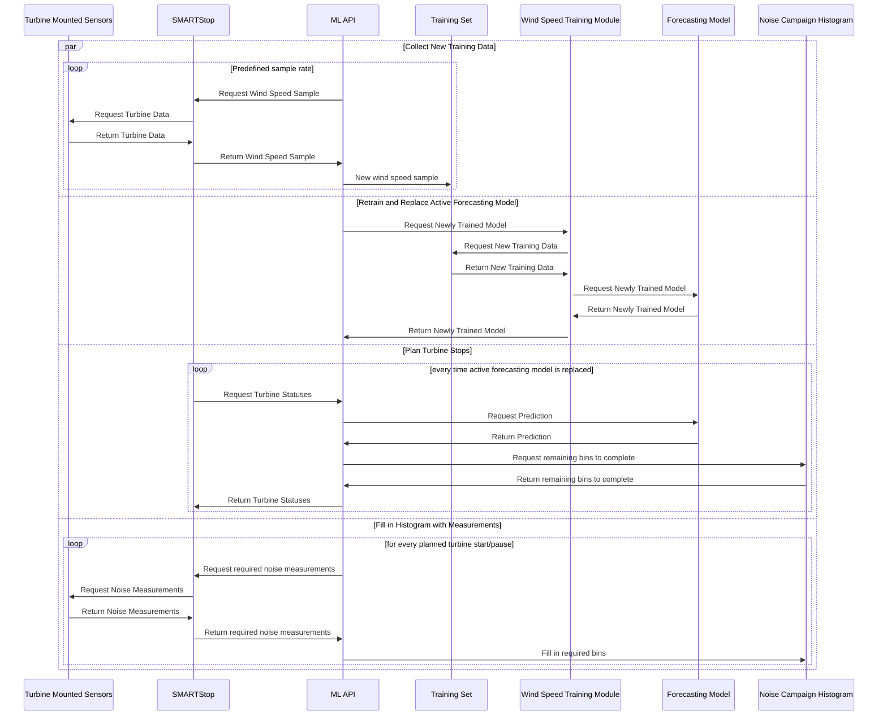

# Proactive and Reactive Decision Making Over Wind Turbine Time Series Data

## System Overview

## Resouces
Data: https://drive.google.com/drive/folders/1OxU2EAok-bl-nMdh3CevdV7jY4nMOJ7Q?usp=sharing

Task tracker: https://github.com/hannahmehravari/dissertation/projects/1
