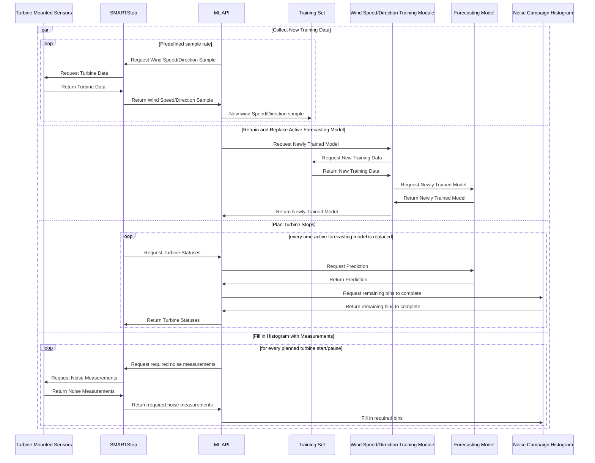
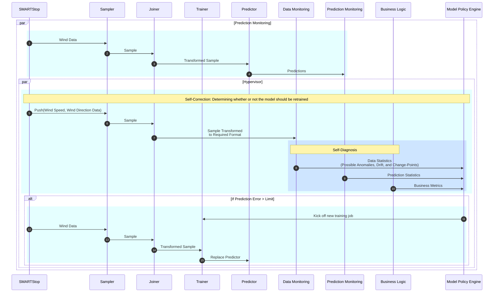

# System Design Diagrams
## Version 1

```mermaid
%% YOU NEED A MERMAID MARKDOWN PLUGIN TO RENDER THIS DIAGRAM 
sequenceDiagram
    participant Turbine Mounted Sensors
    participant SMARTStop
    par Collect New Training Data
    loop Predefined sample rate
    ML API->>SMARTStop: Request Wind Speed/Direction Sample
    SMARTStop->>Turbine Mounted Sensors:Request Turbine Data
    Turbine Mounted Sensors->>SMARTStop: Return Turbine Data
    SMARTStop->>ML API: Return Wind Speed/Direction Sample
    ML API ->> Training Set: New wind Speed/Direction sample
    end
    and Retrain and Replace Active Forecasting Model
    ML API->>+Wind Speed/Direction Training Module:Request Newly Trained Model
    Wind Speed/Direction Training Module->>Training Set:Request New Training Data
    Training Set->>Wind Speed/Direction Training Module: Return New Training Data
    Wind Speed/Direction Training Module->>Forecasting Model: Request Newly Trained Model
    Forecasting Model->>Wind Speed/Direction Training Module: Return Newly Trained Model
    Wind Speed/Direction Training Module->> ML API: Return Newly Trained Model
    and Plan Turbine Stops
    loop every time active forecasting model is replaced
    SMARTStop->>ML API:Request Turbine Statuses
    ML API->> Forecasting Model: Request Prediction
    Forecasting Model->>ML API:Return Prediction
    ML API->> Noise Campaign Histogram: Request remaining bins to complete
    Noise Campaign Histogram->>ML API: Return remaining bins to complete
    ML API ->> SMARTStop: Return Turbine Statuses
    end
    and Fill in Histogram with Measurements
    loop for every planned turbine start/pause
    ML API->> SMARTStop: Request required noise measurements
    SMARTStop->>Turbine Mounted Sensors:Request Noise Measurements
    Turbine Mounted Sensors->> SMARTStop: Return Noise Measurements
    SMARTStop ->>ML API: Return required noise measurements
    ML API ->> Noise Campaign Histogram: Fill in required bins
    end
    end
```

## Version 2

### AutoML API

```mermaid
sequenceDiagram
    participant SMARTStop
    participant Sampler
    participant Joiner
    participant Trainer
    participant Predictor
    participant Data Monitoring
    participant Prediction Monitoring
    participant Business Logic
    participant Model Policy Engine
    autonumber
    par Prediction Monitoring
    rect rgba(0, 255, 255, .1)
    SMARTStop->>Sampler:Wind Data
    Sampler->>Joiner:Sample 
    Joiner->>Predictor:Transformed Sample
    Predictor->>Prediction Monitoring:Predictions
    end
    par Hypervisor
    rect rgba(0, 255, 255, .1)
    Note over SMARTStop, Model Policy Engine: Self-Correction: Determining whether or not the model should be retrained
    SMARTStop->>Sampler:Push(Wind Speed, Wind Direction Data)
    Sampler->>Joiner:Sample 
    Joiner->>Data Monitoring:Sample Transformed<br>to Required Format
    rect rgba(0, 0, 255, .1)
    Note over Data Monitoring,Business Logic: Self-Diagnosis
    Data Monitoring->>Model Policy Engine:Data Statistics<br>(Possible Anomalies, Drift, and Change-Points)
    Prediction Monitoring->>Model Policy Engine:Prediction Statistics   
    Business Logic->>Model Policy Engine: Business Metrics
    end
    end
    alt If Prediction Error > Limit
    rect rgba(0, 255, 255, .1)
    Model Policy Engine->>Trainer: Kick off new training job
    SMARTStop->>Sampler:Wind Data
    Sampler->>Joiner:Sample 
    Joiner->>Trainer:Transformed Sample
    Trainer->>Predictor: Replace Predictor
    end
    end
    end
    end
```

